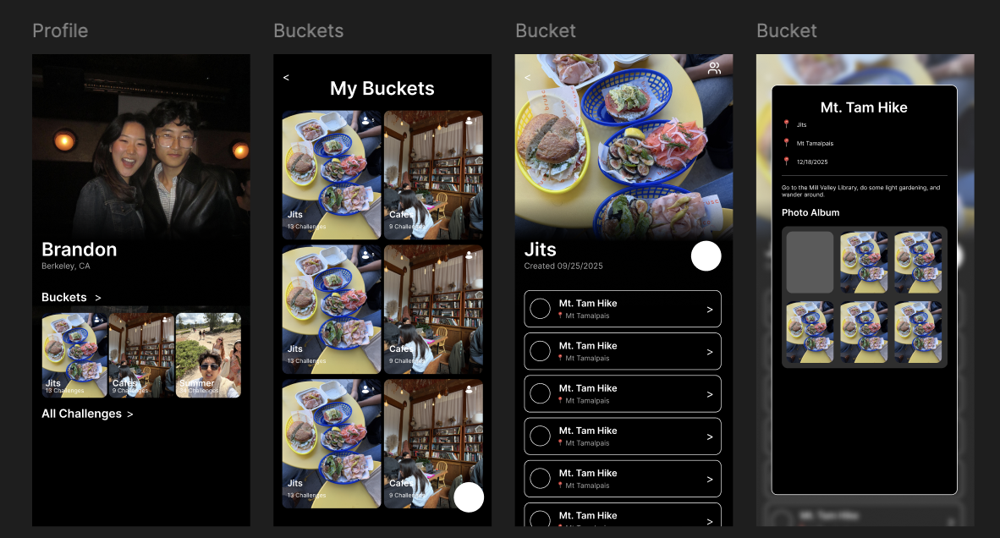

# Buckit
## Initial Design Mockups

## PRD v1.0
[Read the full document here](https://docs.google.com/document/d/1zJ0PVIeczIu6qECpJUD3cGE9qiwpAGbLtxmicYlJFzo/edit?usp=sharing)

## Technical Design
### Scoring
The scoring system for the recommendation system is as follows:

=%5Cunderbrace%7B%5Calpha%5C,%5Ctextbf%7BAppeal%7D_%7B%5Ctext%7BMM%7D%7D(i)%7D_%7B%5Ctext%7BDMN/appeal%7D%7D&plus;%5Cunderbrace%7B%5Cbeta%5C,%5Clangle%5Cmathbf%7Bz%7D%5E%7B%5Ctext%7Btrait%7D%7D_u,%5Cmathbf%7Be%7D_i%5Crangle%7D_%7B%5Ctext%7Bwho%20you%20are%7D%7D&plus;%5Cunderbrace%7B%5Cgamma%5C,%5Clangle%5Cmathbf%7Bz%7D%5E%7B%5Ctext%7Bstate%7D%7D_u(c),%5Cmathbf%7Be%7D_i%5Crangle%7D_%7B%5Ctext%7Bhow%20you%20feel%20now%7D%7D&plus;%5Cunderbrace%7B%5Cdelta%5C,%5Ctext%7BSocialBonus%7D(u,i)%7D_%7B%5Ctext%7BvmPFC%20social%7D%7D-%5Cunderbrace%7B%5Clambda%5C,%5Ctext%7BEffortCost%7D(i,c)%7D_%7B%5Ctext%7Bvalue%20minus%20cost%7D%7D&plus;%5Cunderbrace%7B%5Crho%5C,%5Ctext%7BNovelty/Diversity%7D(i%5Cmid%5Cmathcal%7BL%7D)%7D_%7B%5Ctext%7Bmulti-objective%7D%7D)

### Reasoning, Inspiration, and Scientific Backing
